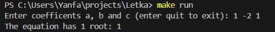
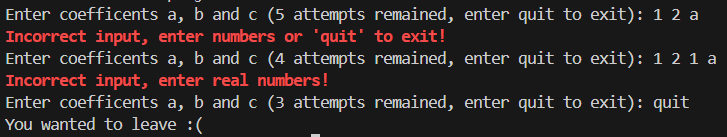
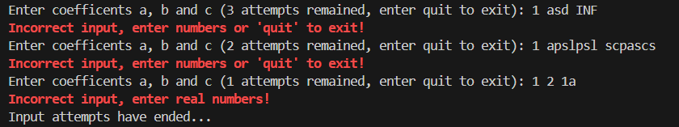

# The solver of quadratic equations

A unique program that can solve quadratic (and not only) equations. The program was written in the C programming language during the summer school under the guidance of the best mentor - Yaroslav 😎

The program requests 3 numbers - the coefficients of the equation and outputs the result to the console. It is also possible to pass arguments through the command console:
```bash
-h calls the helр commands
-t {file name} starts the automatic testing mode (by reading data from a file)
-s starts the input coefficients mode fоr solving equation (enabled by default)
-a {number} limited input mode fоr {number} attempts
```

## Installation and compilation
To run the program on your computer, download the repository and run the Makefile
1. Cloning a repository
```bash
git clone https://github.com/Yan103/Quadratic-equation
```
2. Compilation of source files
```bash
make
```
3. Start (in solver mode)
```bash
make run
```
4. Optional: remove files (deleting object and executable files)
```bash
make clean
```

## Examples of work
When using the normal mode (-s by default), the user is prompted to enter the coefficients of the equation and, if entered correctly, the program will print the solutions of the equation



While entering the coefficients, the user can write the word "quit" and the program will finish its execution ahead of time



If attempts end when using the operation mode with attempts (-a {number}), then the program also ends



## Contact information
If you are interested in this project or have any questions/suggestions about the project, you can contact the author:

Mail: fazleev.yans@phystech.edu

Telegram: @yan_ya_n3


